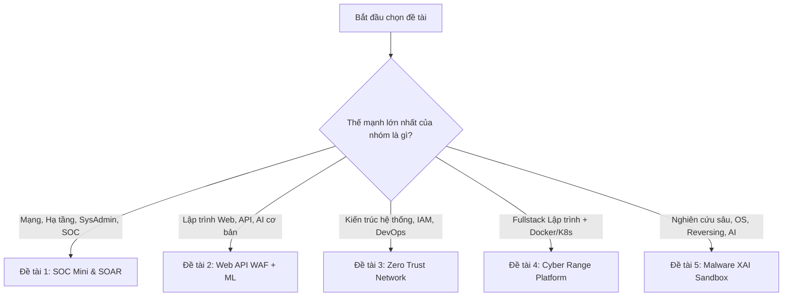

# BÁO CÁO PHÂN TÍCH VÀ ĐÁNH GIÁ CHI TIẾT CÁC ĐỀ TÀI PBL6 - AN TOÀN THÔNG TIN

---

## I. TỔNG QUAN VÀ MA TRẬN SO SÁNH ĐA TIÊU CHÍ

### 1. Bảng so sánh tổng hợp 5 đề tài

| STT | Tên Đề Tài | Hướng Chuyên Môn | Độ Khó (1-5★) | Khối Lượng Hạ Tầng | Kỹ Năng / Công Nghệ Trọng Tâm | Tính Khả Thi & Ứng Dụng | Điểm Nhấn Tạo Đột Phá |
| :---: | :--- | :--- | :---: | :--- | :--- | :--- | :--- |
| **1** | **Xây dựng hệ thống SOC mini & Ứng phó sự cố** | Blue Team / SecOps / SIEM | ★★★☆☆ | Cao (Nhiều VM/Container) | Wazuh, Elastic Stack, Suricata, Zeek, Python, Docker | Rất cao (Chuẩn quy trình doanh nghiệp) | Kết hợp ML phát hiện bất thường + Tự động phản ứng (SOAR). |
| **2** | **Phát hiện & Ngăn chặn tấn công Web API bằng ML** | AppSec / AI in Cyber / WAF | ★★★☆☆ | Trung bình (Web + WAF + ML) | Python, FastAPI, Scikit-Learn, XGBoost, LSTM, ModSecurity | Rất cao (Đo lường định lượng rõ) | Bộ dataset thực tế tự thu thập + So sánh Rule-based vs ML vs Hybrid. |
| **3** | **Xây dựng hệ thống Zero Trust Network Access (ZTNA)** | Architecture / IAM / Network Sec | ★★★★☆ | Trung bình - Cao (Gateway, IdP) | Keycloak, OPA, WireGuard, Go / NodeJS, Docker | Cao (Xu hướng bảo mật mới) | Continuous Verification & Context-based Adaptive Access Control. |
| **4** | **Cyber Range & Chấm điểm phòng thủ tự động** | Fullstack Cyber / CTF Platform | ★★★★☆ | Cao (Cụm mạng Red/Blue) | Docker, Kubernetes, Web Fullstack (Next.js/React, FastAPI), Bash | Cao (Công cụ đào tạo lâu dài) | Scoring Engine tự động theo thời gian thực (Real-time Evaluation). |
| **5** | **Phát hiện mã độc & Phân tích hành vi bằng AI (XAI)** | Malware / AI / OS Internals | ★★★★★ | Rất cao (Isolated Sandbox) | Cuckoo/CAPE Sandbox, Python, Scikit-learn, XGBoost, SHAP/LIME | Cao (Học thuật & nghiên cứu sâu) | Explainable AI (XAI): Giải thích nguyên nhân phân loại độc hại. |

---

## II. PHÂN TÍCH CHI TIẾT TỪNG ĐỀ TÀI

---

### ĐỀ TÀI 1: XÂY DỰNG HỆ THỐNG SOC MINI VÀ NỀN TẢNG PHÁT HIỆN & ỨNG PHÓ TẤN CÔNG

#### 1. Mục tiêu và Kiến trúc hệ thống
* **Mục tiêu:** Xây dựng một Trung tâm điều hành an ninh mạng (SOC) thu nhỏ, có khả năng thu thập tập trung log từ nhiều nguồn (Windows, Linux, Web, Database, Network), phát hiện dấu hiệu tấn công dựa trên Rule và Anomaly Detection, đồng thời đưa ra phản ứng tự động.
* **Luồng dữ liệu (Data Pipeline):**
  $$\text{Endpoints/Servers (Log Agent)} \longrightarrow \text{Log Collector (Logstash/Wazuh-indexer)} \longrightarrow \text{SIEM \& Detection Engine} \longrightarrow \text{Alerting (Telegram/Discord/Email)} \longrightarrow \text{Automated Response (SOAR)}$$

#### 2. Các kịch bản tấn công cần mô phỏng trong Lab
1. **SSH / RDP Brute-force:** Dùng Hydra/Medusa tấn công dò mật khẩu.
2. **Port Scanning & Reconnaissance:** Dùng Nmap (SYN scan, Xmas scan, OS detection).
3. **Web Attacks:** SQL Injection, XSS, Path Traversal, File Upload nhắm vào Web Server.
4. **Privilege Escalation & Account Compromise:** Sudo abuse, khai thác lỗ hổng kernel để leo thang đặc quyền.
5. **C2 & Lateral Movement:** Kết nối ra server điều khiển C2, dò quét mạng nội bộ.

#### 3. Bộ công nghệ đề xuất (Tech Stack)
* **Log Collection & SIEM:** Wazuh (Khuyến nghị số 1) hoặc Elastic Security (Elasticsearch + Logstash + Kibana + Fleet Agent).
* **Network IDS/IPS:** Suricata hoặc Zeek (Bro).
* **Incident Response (SOAR mini):** TheHive + Cortex hoặc viết Python/Bash webhook tự động khóa IP trên Firewall (iptables / UFW).
* **Machine Learning Nâng cao:** Isolation Forest hoặc Autoencoder trên auth logs để phát hiện đăng nhập bất thường.

#### 4. Ưu điểm & Rủi ro
* **Ưu điểm:** Bám rất sát thực tế ngành An toàn thông tin doanh nghiệp, dễ demo trực quan bằng Dashboard Kibana/Grafana.
* **Rủi ro:** Hệ thống ngốn nhiều tài nguyên RAM (khuyến nghị máy chủ lab $\ge 16\text{GB}$ RAM nếu chạy cụm ELK/Wazuh hoàn chỉnh).

---

### ĐỀ TÀI 2: PHÁT HIỆN VÀ NGĂN CHẶN TẤN CÔNG WEB API BẰNG MACHINE LEARNING

#### 1. Mục tiêu và Kiến trúc hệ thống
* **Mục tiêu:** Xây dựng lớp WAF/API Gateway thông minh đứng trước Web API, kết hợp cơ chế kiểm tra luật truyền thống với các mô hình Machine Learning để nhận diện payload độc hại và hành vi bất thường.
* **Kiến trúc luồng xử lý:**
  $$\text{Client Request} \longrightarrow \text{API Gateway / Reverse Proxy} \longrightarrow \text{Feature Extraction} \longrightarrow \text{Inference Model} \longrightarrow \begin{cases} \text{Block / 403 Forbidden (Attack)} \\ \text{Forward to Backend API (Legitimate)} \end{cases}$$

#### 2. Không gian đặc trưng (Feature Engineering)
* **Đặc trưng nội dung (Payload-based):** Chiều dài URL/Body, tỷ lệ ký tự đặc biệt (`'`, `"`, `<`, `>`, `\`, `;`), số lượng từ khóa SQL/Script (`UNION`, `SELECT`, `<script>`, `exec`), entropy chuỗi.
* **Đặc trưng hành vi (Behavior-based):** Tần suất gửi request (RPS), khoảng cách thời gian giữa các request, tỷ lệ HTTP Status 4xx/5xx của IP, Fingerprint bất thường.

#### 3. Bộ công nghệ đề xuất (Tech Stack)
* **Backend API & Gateway:** Python (FastAPI) hoặc Go, NGINX / Envoy Proxy.
* **Môi trường giả lập tấn công (Vulnerable Apps):** OWASP Juice Shop, crAPI (completely ridiculous API), DVWA.
* **Machine Learning Models:**
  * Mô hình truyền thống: TF-IDF + Random Forest / XGBoost / SVM (cho payload classification).
  * Mô hình chuỗi: Word2Vec + Bi-LSTM hoặc Transformer/DistilBERT rút gọn.
  * Anomaly Detection: Isolation Forest / Autoencoder (phát hiện API abuse/DDoS).

#### 4. Tiêu chí đánh giá chất lượng
* **Chỉ số:** Precision, Recall, F1-Score, False Positive Rate (FPR), ROC-AUC.
* **Độ trễ:** Thời gian trích xuất đặc trưng và inference phải $< 15\text{ms}$ mỗi request để không ảnh hưởng hiệu năng hệ thống.

---

### ĐỀ TÀI 3: XÂY DỰNG HỆ THỐNG ZERO TRUST NETWORK ACCESS (ZTNA) CHO DOANH NGHIỆP

#### 1. Mục tiêu và Kiến trúc hệ thống
* **Mục tiêu:** Triển khai mô hình bảo mật "Never Trust, Always Verify", thay thế VPN truyền thống bằng cơ chế kiểm soát truy cập thích ứng theo ngữ cảnh người dùng, thiết bị và chính sách động.
* **Kiến trúc ZTNA tiêu chuẩn:**
  $$\text{User/Device} \longrightarrow \text{Policy Enforcement Point (PEP - Gateway)} \overset{\text{Check Policy}}{\longleftrightarrow} \text{Policy Decision Point (PDP - OPA)} \longleftrightarrow \text{Identity Provider (IdP/MFA)}$$

#### 2. Kịch bản đánh giá & Chính sách mẫu
* **Chính sách phân quyền theo vai trò (RBAC/ABAC):**
  * Sinh viên: Chỉ truy cập LMS qua mạng Internet.
  * Giảng viên: Truy cập LMS + Hệ thống quản lý điểm thi (yêu cầu MFA).
  * Quản trị viên (Admin): Chỉ truy cập Server SSH/Database khi dùng máy tính của tổ chức (Device Health: có chứng chỉ hợp lệ, OS đã cập nhật, antivirus đang chạy).
* **Kịch bản Continuous Trust:** Người dùng đăng nhập thành công nhưng sau đó đổi IP bất thường hoặc thiết bị nhiễm virus $\rightarrow$ Hệ thống tự động thu hồi session ngay lập tức.

#### 3. Bộ công nghệ đề xuất (Tech Stack)
* **Identity & Access Management (IAM):** Keycloak hoặc Authentik (hỗ trợ OIDC, SAML, TOTP/WebAuthn MFA).
* **Policy Engine:** Open Policy Agent (OPA) viết bằng ngôn ngữ Rego.
* **Network / Tunneling & Proxy:** WireGuard VPN / Tailscale (Mesh VPN) kết hợp Reverse Proxy (Envoy / Traefik / NGINX).
* **Device Health Checking:** Agent nhỏ viết bằng Go/Python kiểm tra trạng thái máy trạm trước khi cấp chứng chỉ.

---

### ĐỀ TÀI 4: XÂY DỰNG CYBER RANGE VÀ HỆ THỐNG TỰ ĐỘNG ĐÁNH GIÁ KỸ NĂNG PHÒNG THỦ

#### 1. Mục tiêu và Kiến trúc hệ thống
* **Mục tiêu:** Xây dựng một nền tảng thao trường mạng (Cyber Range) ảo hóa, cung cấp các bài lab mạng đa dạng và hệ thống chấm điểm tự động các hành động phòng thủ (Blue Team) và tấn công (Red Team).
* **Kiến trúc hệ thống:**
  * **Management & Web UI:** Dashboard quản trị, bảng xếp hạng (Leaderboard), tạo lab theo yêu cầu.
  * **Infrastructure Engine:** Cụm Docker/K3s tự động dựng bài thi (Scenario Provisioning).
  * **Scoring & Verification Daemon:** Service giám sát trạng thái máy ảo, log, network packet để chấm điểm.

#### 2. Bảng phân phối điểm kịch bản mẫu
| Hạng mục kịch bản | Hành động của thí sinh (Blue Team) | Cơ chế kiểm tra tự động của hệ thống | Điểm |
| :--- | :--- | :--- | :---: |
| **Recon Detection** | Phát hiện quét cổng Nmap | Check log cảnh báo trong SIEM / Suricata | 10 |
| **Attack Detection** | Phát hiện Brute-force / Web Attack | Check ticket incident do thí sinh submit đúng IP/thời gian | 15 |
| **Host Isolation** | Cô lập máy bị nhiễm mã độc | Kiểm tra firewall rule hoặc lệnh ngắt kết nối mạng | 20 |
| **Remediation** | Vá lỗ hổng / Đổi mật khẩu lộ / Diệt tiến trình độc | Script tự động chạy lại exploit test nếu thất bại $\rightarrow$ Đạt | 25 |
| **Service Recovery** | Khôi phục dịch vụ web/database hoạt động lại | Healthcheck HTTP/TCP port | 20 |
| **Incident Report** | Gửi báo cáo phân tích sự cố | Đánh giá qua template tự động / Form trắc nghiệm | 10 |

#### 3. Bộ công nghệ đề xuất (Tech Stack)
* **Frontend/Backend:** Next.js (Tailwind CSS, Lucide icons), FastAPI / NestJS, PostgreSQL.
* **Orchestration:** Docker Engine API, Proxmox VE API hoặc K3s (Lightweight Kubernetes).
* **Automation & Scoring:** Python Celery, Redis queue, Paramiko/SSH automation, Scapy.

---

### ĐỀ TÀI 5: PHÁT HIỆN MÃ ĐỘC VÀ PHÂN TÍCH HÀNH VI BẰNG AI (KÈM EXPLAINABLE AI)

#### 1. Mục tiêu và Kiến trúc hệ thống
* **Mục tiêu:** Xây dựng hệ thống phát hiện mã độc dựa trên hành vi động (Dynamic Behavior Analysis) kết hợp Machine Learning và Explainable AI (XAI) để giải thích tường minh nguyên nhân gán nhãn độc hại.
* **Quy trình phân tích (Pipeline):**
  $$\text{File/Sample} \longrightarrow \text{Automated Sandbox Execution} \longrightarrow \text{Behavioral Trace Extraction} \longrightarrow \text{Feature Vector} \longrightarrow \text{ML Classifier} \longrightarrow \text{XAI Explanation (SHAP/LIME)}$$

#### 2. Các nhóm đặc trưng hành vi trích xuất
1. **API Call Sequences:** Tần suất và thứ tự gọi các hàm nhạy cảm (`CreateRemoteThread`, `VirtualAllocEx`, `WriteProcessMemory`, `RegSetValueEx`).
2. **Registry Changes:** Sửa đổi khóa Run/RunOnce, tắt Windows Defender, thay đổi chính sách bảo mật.
3. **File System Operations:** Tạo file trong `%TEMP%`, `%APPDATA%`, drop payload DLL, tự đổi tên.
4. **Network Activities:** DNS query tới domain DGA/độc hại, kết nối IP lạ, giao thức C2 bất thường.
5. **Process Tree Anomalies:** Quá trình `powershell.exe` sinh ra từ `word.exe`, tiến trình ẩn, inject code.

#### 3. Module Explainable AI (XAI)
* **Công cụ:** SHAP (SHapley Additive exPlanations) và LIME.
* **Giá trị mang lại:**
  * Không chỉ trả về kết quả `Malware: 98%`, mà hiển thị biểu đồ lực tác động (Force Plot) chỉ rõ:
    * *+35% do gọi hàm `VirtualAllocEx` với quyền `PAGE_EXECUTE_READWRITE`.*
    * *+25% do ghi khóa Registry tự khởi động `CurrentVersion\Run`.*
    * *+20% do gửi request C2 đến dải IP độc hại.*

#### 4. Bộ công nghệ đề xuất (Tech Stack)
* **Sandbox:** CAPE Sandbox (bản cải tiến tối ưu của Cuckoo) trên môi trường Ubuntu Host + Windows 10 Guest VM.
* **Data & ML:** Python, Pandas, Scikit-learn, LightGBM, XGBoost, CatBoost, PyTorch.
* **XAI & Dashboard:** SHAP library, Matplotlib/Plotly, Streamlit hoặc Web Dashboard.

---

## III. MA TRẬN PHÂN BỔ ĐỀ TÀI THEO NĂNG LỰC & MỤC TIÊU CỦA NHÓM

### Bảng tư vấn nhanh:

| Trường Hợp Của Nhóm | Đề Tài Nên Chọn | Lý Do & Chiến Lược |
| :--- | :---: | :--- |
| **Nhóm muốn an toàn, dễ demo, đúng chuẩn kỹ sư ATTT đi làm** | **Đề tài 1 (SOC)** | Các công cụ đã có sẵn ecosystem hoàn chỉnh (Wazuh), sinh viên chỉ cần cấu hình kịch bản và demo tấn công - phòng thủ trực quan. |
| **Nhóm gồm các bạn chuyên Web/App muốn tích hợp AI thực tế** | **Đề tài 2 (Web API ML)** | Tận dụng kỹ năng làm Web/API, code Python/AI vừa sức, dễ viết báo cáo định lượng với biểu đồ so sánh rõ ràng. |
| **Nhóm thích các công nghệ mới, kiến trúc Cloud & IAM** | **Đề tài 3 (Zero Trust)** | Đề tài mang tính thời sự cao, doanh nghiệp hiện nay đang chuyển dịch từ VPN sang ZTNA rất mạnh mẽ. |
| **Nhóm mạnh code Fullstack, muốn sản phẩm có tính hoàn thiện cao** | **Đề tài 4 (Cyber Range)** | Sản phẩm có Web UI đẹp mắt, nhiều tính năng tương tác, có thể phát triển thành sản phẩm đồ án tốt nghiệp xuất sắc. |
| **Nhóm muốn hướng nghiên cứu học thuật, viết bài báo/nghiên cứu sâu** | **Đề tài 5 (Malware XAI)** | Khả năng đạt điểm tuyệt đối cao nhất nếu hoàn thiện được Sandbox + Mô hình AI giải thích được hành vi mã độc. |

---

## IV. LỘ TRÌNH THỰC HIỆN ĐỀ XUẤT (10 TUẦN)

* **Tuần 1 - 2 (Khảo sát & Thiết kế):**
  * Nghiên cứu tài liệu lý thuyết, chốt kiến trúc hệ thống, dựng sơ đồ luồng dữ liệu (Architecture Diagram).
  * Chuẩn bị môi trường Lab, máy ảo, tài nguyên phần cứng.
* **Tuần 3 - 5 (Phát triển Core Engine):**
  * Cài đặt các thành phần nền tảng (SIEM / WAF / IdP / Sandbox / Range Orchestrator).
  * Xây dựng kịch bản kiểm thử mẫu (Attack Scenarios / Test Cases).
* **Tuần 6 - 7 (Tích hợp & Xử lý nâng cao):**
  * Tích hợp Machine Learning / Rule Engine / Policy Enforcement / Scoring Logic.
  * Thu thập dữ liệu thực tế và tinh chỉnh độ chính xác.
* **Tuần 8 - 9 (Kiểm thử, Đánh giá & Viết báo cáo):**
  * Đo đạc các chỉ số (Accuracy, Detection Latency, False Positive Rate).
  * Đóng gói Docker, hoàn thiện Dashboard trực quan.
* **Tuần 10 (Hoàn thiện & Chuẩn bị Báo cáo bảo vệ):**
  * Quay video demo kịch bản tấn công - phản ứng.
  * Chuẩn bị Slide thuyết trình và hồ sơ đồ án.
