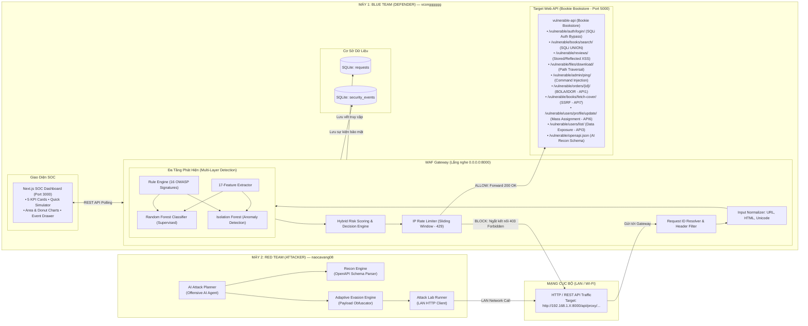

# Kiến Trúc Hệ Thống (System Architecture) — PBL6
## Mô Hình Thao Trường An Ninh Phân Tán (Distributed Cyber Range: Red Team vs Blue Team)

---

## 1. Tổng Quan Kiến Trúc (Architecture Overview)

Dự án **Web API Security Platform & Autonomous Red Teaming** được thiết kế theo mô hình **Thao trường An ninh Đối kháng Phân tán (Distributed Cyber Range)** triển khai trên **2 máy vật lý độc lập** kết nối qua mạng cục bộ (LAN / Wi-Fi):

* **MÁY 1 (Blue Team — Phòng thủ — Phụ trách: `vcongggggg`):** Vận hành hệ thống phòng vệ gồm WAF Gateway (Reverse Proxy + Rule Engine + ML Detection Engine), ứng dụng mục tiêu tự xây dựng `vulnerable-api`, và trung tâm chỉ huy an ninh SOC Dashboard.
* **MÁY 2 (Red Team — Tấn công — Phụ trách: `naocavang08`):** Vận hành hệ thống tấn công tự động gồm **AI Attack Planner (Offensive AI Agent)** và công cụ bắn payload thích ứng (Adaptive Evasion Engine) tấn công từ xa qua mạng LAN vào Máy 1.

---

## 2. Ranh Giới Và Trách Nhiệm Từng Thành Phần (Component Boundaries)

### 2.1. `vulnerable-api/` (Target Web API Tự Xây Dựng — Bookie Bookstore)
* **Lý do tự xây dựng:** Theo chỉ đạo của Giảng viên hướng dẫn, việc tự xây dựng Web API giúp nhóm làm chủ 100% mã nguồn, hiểu tường tận cơ chế khai thác các lỗ hổng OWASP Top 10 trên Web API thực tế, và cho phép định hình cấu trúc dữ liệu theo đúng yêu cầu đề tài (thay thế hoàn toàn OWASP Juice Shop).
* **Ứng dụng thực tế:** Nền tảng thương mại điện tử Bookie Bookstore với cơ sở dữ liệu SQLite, quản lý sách, đơn hàng, người dùng và đánh giá.
* **Cổng dịch vụ:** Chạy nội bộ trên Port `5000` (chỉ cho phép Gateway kết nối qua mạng Docker hoặc localhost).
* **8 Kịch bản lỗ hổng trọng điểm (OWASP Web & API Top 10):**
  1. `POST /api/v1/vulnerable/auth/login/`: Xác thực người dùng — Lỗ hổng **SQL Injection Auth Bypass** (`' OR '1'='1`) và **Brute Force**.
  2. `GET /api/v1/vulnerable/books/search/?q=...`: Tra cứu danh mục — Lỗ hổng **SQL Injection UNION-based** (`' UNION SELECT ...`).
  3. `GET & POST /api/v1/vulnerable/reviews/`: Đánh giá sách — Lỗ hổng **Stored & Reflected Cross-Site Scripting (XSS)** (``).
  4. `GET /api/v1/vulnerable/files/download/?file=...`: Tải tài liệu/file — Lỗ hổng **Path Traversal / Local File Inclusion (LFI)** (`../../windows/win.ini` hoặc `../../etc/passwd`).
  5. `POST /api/v1/vulnerable/admin/ping/`: Quản trị chẩn đoán mạng — Lỗ hổng **Command Injection (RCE)** (`127.0.0.1; whoami`).
  6. `GET & PUT /api/v1/vulnerable/orders/<int:order_id>/`: Chi tiết đơn hàng — Lỗ hổng **Broken Object Level Authorization (BOLA / IDOR - OWASP API1:2023)** xem và sửa đơn hàng của người khác mà không kiểm tra quyền.
  7. `GET & POST /api/v1/vulnerable/books/fetch-cover/?url=...`: Tải ảnh bìa sách từ xa — Lỗ hổng **Server-Side Request Forgery (SSRF - OWASP API7:2023)** quét mạng nội bộ hoặc trích xuất metadata server.
  8. `POST /api/v1/vulnerable/users/profile/update/`: Cập nhật thông tin — Lỗ hổng **Mass Assignment & Privilege Escalation (OWASP API6:2023)** tự gán quyền `is_staff`, `is_superuser`.
  * **Kèm theo:**
    * `GET /api/v1/vulnerable/users/list/`: Lỗ hổng **Excessive Data Exposure (OWASP API3:2023)** làm lộ toàn bộ password hashes và tokens nội bộ.
    * `GET /api/v1/vulnerable/openapi.json`: Cung cấp đặc tả OpenAPI 3.0 chuẩn để AI Attack Planner bên Máy 2 tự động trinh sát (Reconnaissance).

### 2.2. `gateway/` (WAF Reverse Proxy Gateway — Lớp Phòng Thủ Chính)
* **Vị trí:** Đứng trước `vulnerable-api`, lắng nghe trên `0.0.0.0:8000` để các máy trong mạng LAN đều có thể gửi request tới.
* **Pipeline xử lý tuần tự (Request Pipeline):**
  1. **Request Surface Parser & Resolver:** Bóc tách toàn bộ bề mặt request (Path, Query Params, Headers, JSON/Form Body), cấp phát `X-Request-ID`.
  2. **Input Normalizer:** Chuẩn hóa đa tầng (URL decode đệ quy, HTML unescape, Unicode NFC canonicalization, loại bỏ ký tự rác/khoảng trắng dư thừa).
  3. **Rule Engine (Phase 2 - Hoàn thành):** Kiểm tra đối sánh 16 signatures tất định (SQLi, XSS, Path, Cmd), chấm điểm rủi ro quy chuẩn 0–100 (`RuleScorer`).
  4. **Feature Extraction (Phase 3 - Sắp làm):** Trích xuất vector 17 đặc trưng thống kê và ngữ cảnh từ request.
  5. **Machine Learning Engines (Phase 5 & 6):**
     * **Random Forest:** Phân loại đa lớp (Benign, SQLi, XSS, Path Traversal, Command Injection).
     * **Isolation Forest:** Đo lường độ dị biệt (Anomaly Score) phát hiện các cuộc tấn công Zero-day hoặc hành vi bất thường.
  6. **Hybrid Decision Engine (Phase 7):** Tổng hợp điểm số từ Rule + ML + Anomaly thành Weighted Risk Score và ra quyết định phòng thủ:
     * `ALLOW` ($< 40$): Cho phép request đi tiếp tới `vulnerable-api`.
     * `MONITOR` ($40 - 69$): Cho phép đi tiếp nhưng đánh dấu nghi vấn và ghi log chi tiết.
     * `RATE_LIMIT` / `CHALLENGE`: Trả về `HTTP 429 Too Many Requests`.
     * `BLOCK` ($\ge 70$): Ngắt kết nối ngay lập tức tại Gateway, trả về `HTTP 403 Forbidden`.
  7. **Persistence:** Ghi nhận lưu lượng vào bảng `requests` và sự kiện an ninh vào `security_events` trong SQLite (`waf_gateway.db`).

### 2.3. `dashboard/` (SOC Command Center — Màn Hình Giám Sát Thời Gian Thực)
* **Công nghệ:** Next.js 14 (App Router), Tailwind CSS, Recharts, Lucide Icons.
* **Cổng dịch vụ:** Port `3000`.
* **Tính năng hoàn thành (Phase 9):**
  * 5 KPI Cards (Total Traffic, Attacks Detected, Threat Score, Safe Request Rate, Quick Simulator).
  * Area Chart sóng kép biểu diễn lưu lượng sạch vs tấn công theo thời gian thực.
  * Donut Chart phân bố tỷ lệ các họ tấn công đã nhận diện.
  * Bảng sự kiện an ninh Live Events và ngăn kéo Payload Evidence Drawer đối chiếu chi tiết Raw Input vs Canonical Normalized.

### 2.4. `attack-lab/` (Offensive AI — AI Attack Planner Trên Máy 2)
* **Vị trí triển khai:** Chạy độc lập trên **MÁY 2 (Red Team)**.
* **Cơ chế hoạt động:**
  1. **Tự động Trinh sát (Automated Reconnaissance):** Đọc file đặc tả OpenAPI schema từ Máy 1 (`http://192.168.1.X:8000/api/proxy/openapi.json`), lập bản đồ bề mặt tấn công (Attack Surface Mapping).
  2. **AI Planning Agent:** Sử dụng AI/LLM hoặc máy trạng thái heuristic để lên kế hoạch chuỗi tấn công (Kill Chain: Dò quét $\rightarrow$ Vượt quyền đăng nhập bằng SQLi $\rightarrow$ Khai thác chiếm quyền server qua Command Injection).
  3. **Adaptive Evasion Engine:** Khi Gateway của Máy 1 chặn `403 Forbidden`, AI Planner tự động suy luận lý do bị chặn và tiến hành biến đổi payload (Mã hóa URL kép, hoán đổi ký tự viết hoa/thường, chèn comment nội dòng `/**/`, thay thế hàm tương đương) để bắn lại nhằm tìm cách vượt rào WAF.

---

## 3. Ma Trận Triển Khai & Phân Chia Trách Nhiệm 2 Máy

| Thành Phần Hệ Thống | Vị Trí Triển Khai | Thành Viên Phụ Trách | Trạng Thái Kỹ Thuật |
| :--- | :--- | :--- | :---: |
| **vulnerable-api** (Custom Web API) | **MÁY 1 (Blue Team)** | `vcongggggg` | 🚀 Tiếp tục xây dựng |
| **FastAPI WAF Reverse Proxy** | **MÁY 1 (Blue Team)** | `vcongggggg` | ✅ Hoàn thành Phase 1 |
| **Rule-based Detection Engine (16 Rules)** | **MÁY 1 (Blue Team)** | `vcongggggg` | ✅ Hoàn thành Phase 2 |
| **SOC Dashboard (Next.js 14)** | **MÁY 1 (Blue Team)** | `vcongggggg` | ✅ Hoàn thành Phase 9 |
| **Hybrid Decision & Active Blocking (403)**| **MÁY 1 (Blue Team)** | `vcongggggg` | ⏳ Phase 7 |
| **IP Sliding Window Rate Limiter (429)** | **MÁY 1 (Blue Team)** | `vcongggggg` | ⏳ Phase 8 |
| **17-Feature Extractor Pipeline** | Dùng chung (Shared) | `naocavang08` | ⏳ Phase 3 |
| **Dataset Generation (Raw + Synthetic)** | Dùng chung (Shared) | `naocavang08` | ⏳ Phase 4 |
| **Random Forest Supervised Classifier** | Model nạp Máy 1 | `naocavang08` | ⏳ Phase 5 |
| **Isolation Forest Anomaly Detection** | Model nạp Máy 1 | `naocavang08` | ⏳ Phase 6 |
| **AI Attack Planner (Offensive AI Agent)** | **MÁY 2 (Red Team)** | `naocavang08` | ⏳ Phase 10 |
| **Adaptive Evasion & Red Team Campaigns** | **MÁY 2 (Red Team)** | `naocavang08` | ⏳ Phase 10 |
| **Multi-Method Performance Evaluation** | Cả 2 máy | `naocavang08` & `vcongggggg` | ⏳ Phase 11 |
