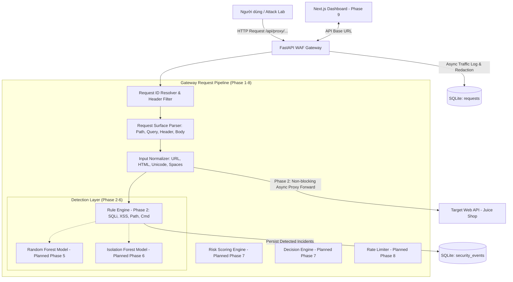

# Kiến Trúc Hệ Thống (System Architecture) — PBL6

## 1. Tổng Quan Kiến Trúc (Architecture Overview)

Dự án **Web API Security Platform** được xây dựng nhằm cung cấp giải pháp bảo vệ toàn diện cho các dịch vụ Web API thông qua kiến trúc Reverse Proxy Gateway kết hợp đa tầng phòng thủ:

---

## 2. Ranh Giới Và Trách Nhiệm Từng Thành Phần (Component Boundaries)

### 2.1. `gateway/` (Backend / WAF Engine)
* **Phase 0:** Khởi tạo ứng dụng FastAPI, cấu hình biến môi trường (`core/config.py`), logging chuẩn (`core/logging.py`), xử lý lỗi an toàn (`core/errors.py`), cấu trúc cơ sở dữ liệu SQLAlchemy (`db/`), và endpoint kiểm tra trạng thái `GET /health`.
* **Phase 1:** Dynamic Reverse Proxy bất đồng bộ (`/api/proxy/{path:path}`), quản lý `X-Request-ID`, lọc hop-by-hop headers, khử thông tin nhạy cảm, chống Open Proxy/SSRF, và endpoint `GET /health/target`.
* **Phase 2 (Hoàn thành):**
  * Triển khai **Rule Engine** (`app/security/`) với 16 rules tất định phủ 4 họ tấn công (SQL Injection, XSS, Path Traversal, Command Injection).
  * Bộ chuẩn hóa dữ liệu đầu vào có giới hạn độ sâu và độ dài (`InputNormalizer`).
  * Cơ chế chấm điểm rủi ro tất định từ 0 đến 100 (`RuleScorer`).
  * Lưu trữ và truy vết sự kiện bảo mật vào bảng `security_events` liên kết chặt chẽ với bảng `requests` qua `request_id`.
  * Hoạt động theo nguyên tắc **Detection Only (Non-blocking)**: Không chặn request ở Phase 2, request vẫn tiếp tục được forward sang target.
* **Tương lai (Phase 3–8 - Planned):** Triển khai trích xuất đặc trưng payload, nạp mô hình ML inference, tính toán Risk score và cơ chế chặn/rate limit.

### 2.2. `ml-engine/` (ML/Data Boundary - Reserved for ML Team)
* **Hiện tại (Phase 0-2):** Khởi tạo cấu trúc thư mục và tài liệu giao diện kết nối kỹ thuật [docs/ML_INTEGRATION.md](file:///c:/Study/HocKy6/PBL6/docs/ML_INTEGRATION.md).
* **Tương lai (Phase 3–6, 11 - Planned):** Xây dựng module trích xuất đặc trưng, sinh tập dữ liệu huấn luyện, huấn luyện mô hình Random Forest & Isolation Forest, xuất file artifacts (`.joblib`).

### 2.3. `dashboard/` (Frontend Visualization)
* **Hiện tại (Phase 0-2):** Khởi tạo khung dự án Next.js 14 + TypeScript sạch sẽ, build thành công và hiển thị trang landing thông báo trạng thái nền tảng.
* **Tương lai (Phase 9 - Planned):** Hiển thị thống kê lưu lượng thời gian thực, bảng nhật ký sự kiện bảo mật, giao diện cấu hình WAF và panel điều khiển Attack Lab.

### 2.4. `attack-lab/` (Attack Simulation)
* **Hiện tại (Phase 0-2):** Cấu trúc thư mục kịch bản `scenarios/` và tài liệu hướng dẫn an toàn.
* **Tương lai (Phase 10 - Planned):** Triển khai các kịch bản tấn công (SQLi, XSS, Path Traversal, API Abuse) và script `runner.py` để tự động hóa chiến dịch thử nghiệm.

---

## 3. Quy Ước Trạng Thái Triển Khai

| Module / Tính Năng | Trạng Thái Hiện Tại | Kế Hoạch Triển Khai |
| :--- | :---: | :--- |
| **FastAPI Foundation & Health API** | ✅ Implemented | Phase 0 |
| **Centralized Config & Safe Logging** | ✅ Implemented | Phase 0 |
| **Database Models & Session Management** | ✅ Implemented | Phase 0 |
| **Next.js Frontend Foundation** | ✅ Implemented | Phase 0 |
| **Docker Compose Orchestration** | ✅ Implemented | Phase 0 |
| **Reverse Proxy & Request Forwarding** | ✅ Implemented | Phase 1 |
| **Traffic Metadata & Redacted DB Logging** | ✅ Implemented | Phase 1 |
| **Open Proxy / SSRF Protection** | ✅ Implemented | Phase 1 |
| **Target Connectivity Health Probe** | ✅ Implemented | Phase 1 |
| **Rule-based Detection Engine (16 Rules)** | ✅ Implemented | Phase 2 |
| **Input Normalization & Canonicalization** | ✅ Implemented | Phase 2 |
| **Rule Risk Scoring (0–100 Bounded)** | ✅ Implemented | Phase 2 |
| **Security Events DB Traceability** | ✅ Implemented | Phase 2 |
| **Feature Extraction (17 Payload + Behavior)**| ⏳ Planned | Phase 3 (ML Team) |
| **Dataset Generation & Lab Collection** | ⏳ Planned | Phase 4 (ML Team) |
| **Random Forest Supervised ML** | ⏳ Planned | Phase 5 (ML Team) |
| **Isolation Forest Anomaly Detection** | ⏳ Planned | Phase 6 (ML Team) |
| **Weighted Risk Scoring & Decision Engine** | ⏳ Planned | Phase 7 |
| **IP-based Rate Limiter (HTTP 429)** | ⏳ Planned | Phase 8 |
| **Security Dashboard UI & Real-time Charts** | ⏳ Planned | Phase 9 |
| **Attack Lab Scenarios & Runner CLI** | ⏳ Planned | Phase 10 |
| **Multi-method Evaluation & Benchmark** | ⏳ Planned | Phase 11 (ML Team) |
