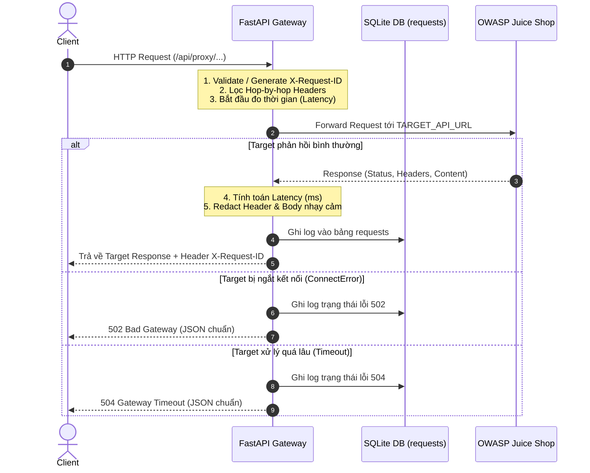

# FastAPI WAF Gateway Specification (Phase 1 Infrastructure)

Tài liệu chi tiết về thiết kế, cơ chế hoạt động và ranh giới kỹ thuật của thành phần **FastAPI Gateway / Reverse Proxy**.

---

## 1. Trách Nhiệm Của Gateway (Gateway Responsibilities)

1. **Đóng vai trò Cổng Đơn Điểm (Single Point of Entry):** Toàn bộ lưu lượng từ Client và Attack Lab đều đi qua Gateway tại cổng `8000`.
2. **Reverse Proxy Chuyển Tiếp Bất Đồng Bộ:** Chuyển tiếp request an toàn tới Target Web API (OWASP Juice Shop) bằng `httpx.AsyncClient` có quản lý Connection Pool.
3. **Định Danh Request (Request ID Tracking):** Tiếp nhận hoặc sinh mới `X-Request-ID` cho từng request để theo dõi xuyên suốt từ Client $\rightarrow$ Gateway $\rightarrow$ Database $\rightarrow$ Client.
4. **Ghi Nhận Lưu Lượng (Traffic Logging):** Lưu trữ metadata request/response vào cơ sở dữ liệu SQLite theo mô hình Service Layer độc lập.
5. **Bảo Mật Cơ Bản (Security Boundaries):**
   * Chống Open Proxy / SSRF: Địa chỉ upstream được cấu hình cố định qua biến môi trường `TARGET_API_URL`.
   * Lọc bỏ Hop-by-hop headers (`Connection`, `Keep-Alive`, `Upgrade`, `Transfer-Encoding`, v.v.).
   * Redact thông tin nhạy cảm (Token, mật khẩu, Authorization header) trước khi lưu log.
   * Xử lý lỗi an toàn không làm lộ stack trace hay địa chỉ IP nội bộ.

---

## 2. Vòng Đời Xử Lý Request (Request Lifecycle)



---

## 3. Chiến Lược Timeout & Quản Lý Kết Nối

Sử dụng `httpx.AsyncClient` khởi tạo trong vòng đời ứng dụng (`lifespan`) với cấu hình timeout rõ ràng:
* `proxy_timeout_connect = 5.0s`: Giới hạn thời gian thiết lập kết nối TCP tới target.
* `proxy_timeout_read = 30.0s`: Giới hạn thời gian chờ target trả về toàn bộ dữ liệu.
* `proxy_timeout_write = 10.0s`: Giới hạn thời gian gửi body sang target.
* `proxy_timeout_pool = 5.0s`: Giới hạn thời gian chờ lấy connection từ connection pool.
* `max_keepalive_connections = 20`, `max_connections = 100`.

---

## 4. Chiến Lược Xử Lý Headers & Dữ Liệu Nhạy Cảm

### 4.1. Lọc Hop-by-hop Headers
Trước khi chuyển tiếp, các header sau sẽ bị loại bỏ:
* `connection`, `keep-alive`, `proxy-authenticate`, `proxy-authorization`
* `te`, `trailers`, `transfer-encoding`, `upgrade`, `host`, `content-length`

### 4.2. Khử Dữ Liệu Nhạy Cảm (Redaction Policy)
* **Headers trong Database:** Các header `Authorization`, `Cookie`, `Set-Cookie`, `X-Api-Key` tự động chuyển thành `[REDACTED]`.
* **JSON Body trong Database:** Các trường `password`, `token`, `access_token`, `refresh_token`, `api_key`, `secret`, `credential` tự động bị ẩn thành `******`.
* **Body Hash:** Tính toán mã băm `SHA-256` của body phục vụ so khớp trong các phase sau.

---

## 5. Ranh Giới Tích Hợp WAF Trong Tương Lai (Future WAF Integration Points)

Kiến trúc Phase 1 được thiết kế theo dạng đường ống (Pipeline), chuẩn bị sẵn các vị trí cắm module cho các phase kế tiếp:

```text
[Incoming Request]
       ↓
(Request Context Middleware - Gắn Request ID)
       ↓
[Phase 1 Proxy Endpoint]
       ↓
   ─── CHUẨN BỊ SẴN ĐIỂM CHÈN (FUTURE PHASES) ───
   │ [Phase 2] Rule Engine (SQLi, XSS, Path Traversal regex filters)
   │ [Phase 3] Feature Extractor (17 Payload Features + Behavior)
   │ [Phase 5] Supervised ML (Random Forest Classification)
   │ [Phase 6] Anomaly Detection (Isolation Forest)
   │ [Phase 7] Risk Scoring & Decision Engine (ALLOW / MONITOR / RATE_LIMIT / BLOCK)
   │ [Phase 8] Rate Limiter (Token Bucket / Sliding Window)
   ─────────────────────────────────────────────
       ↓
[Forward to Upstream Target] (Khi Decision = ALLOW / MONITOR)
       ↓
[Traffic Persistence & Log Event]
       ↓
[Return Response to Client]
```
