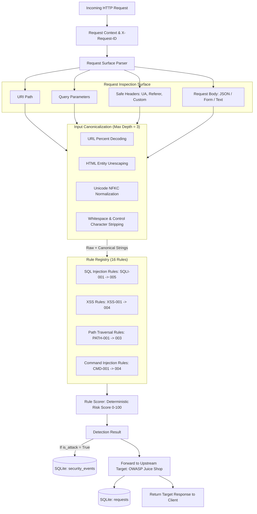

# Đặc Tả Kỹ Thuật Rule Engine / Signature-Based Detection (Phase 2)

Tài liệu chi tiết về kiến trúc, danh mục luật (Rule Catalog), quy trình chuẩn hóa (Normalization), cơ chế chấm điểm rủi ro (Rule Risk Score) và lưu vết sự kiện bảo mật trong **FastAPI WAF Gateway**.

---

## 1. Mục Đích & Nguyên Lý Cốt Lõi (Purpose & Principles)

* **Phát hiện dựa trên dấu hiệu (Signature-Based Detection):** Nhận diện các mẫu tấn công phổ biến trong lưu lượng Web API thông qua biểu thức chính quy được biên dịch tối ưu (`re.compile`).
* **Không làm gián đoạn lưu lượng (Detection Only / Non-Blocking in Phase 2):** Trong Phase 2, WAF Gateway hoạt động ở chế độ quan sát và ghi nhận. Mọi request (kể cả request chứa payload tấn công) đều được kiểm tra, ghi log sự kiện bảo mật vào database và **tiếp tục chuyển tiếp an toàn sang Web API đích (OWASP Juice Shop)**. Cơ chế chặn (HTTP 403 / 429) thuộc về Decision Engine ở Phase 7 & 8.
* **Tính giải thích được (Explainability) & Minh bạch:** Mỗi cảnh báo đều chỉ rõ tấn công loại gì, vị trí nào (`path`, `query`, `body`, `header`), luật nào kích hoạt (`rule_id`), kèm trích xuất bằng chứng (Evidence) đã được khử thông tin nhạy cảm.
* **Độc lập và có thể kiểm thử (Deterministic & Auditable):** Kết quả phân tích và điểm số rủi ro ($0 - 100$) hoàn toàn tất định và độc lập với các mô hình xác suất AI/ML.

---

## 2. Kiến Trúc Pipeline Phát Hiện (Detection Pipeline)

---

## 3. Quy Trình Chuẩn Hóa Dữ Liệu Đầu Vào (Normalization & Canonicalization)

Kẻ tấn công thường áp dụng các kỹ thuật mã hóa (encoding/obfuscation) để lẩn tránh bộ lọc regex. Module [gateway/app/security/normalizer.py](file:///c:/Study/HocKy6/PBL6/gateway/app/security/normalizer.py) thực hiện tiền xử lý theo các giới hạn nghiêm ngặt:

1. **Giới hạn kích thước (Length Bounded):** Cắt tối đa `16,384` ký tự (16 KB) cho mỗi trường chuỗi để ngăn ngừa cạn kiệt bộ nhớ hoặc tấn công DoS payload dài.
2. **Giải mã URL lặp có giới hạn (Bounded Iterative URL Decoding):** Tối đa `max_depth = 3` vòng lặp nhằm hóa giải kỹ thuật Double URL Encoding (`%2527` $\rightarrow$ `%27` $\rightarrow$ `'`) mà không rơi vào vòng lặp vô hạn.
3. **Giải mã HTML Entity:** Chuyển đổi `&lt;`, `&gt;`, `&#x27;`, `&quot;` về ký tự gốc tương ứng.
4. **Chuẩn hóa Unicode NFKC:** Chuyển đổi ký tự Fullwidth và các biến thể Unicode homoglyphs (`＇ ＯＲ １＝１` $\rightarrow$ `' OR 1=1`).
5. **Khử ký tự điều khiển & Khoảng trắng:** Loại bỏ ký tự null byte `\x00` và rút gọn chuỗi khoảng trắng liên tiếp về 1 dấu cách đơn.
6. **Bảo tồn Bằng Chứng Gốc:** Hệ thống giữ song song cả chuỗi thô (`raw_input`) và chuỗi chuẩn hóa (`canonical`) để đối soát.

---

## 4. Danh Mục Luật (Rule Catalog)

Hệ thống bao gồm **16 rules tất định** được phân bổ đều trên 4 họ tấn công chính:

| Rule ID | Họ Tấn Công (Family) | Mức Độ (Severity) | Độ Tin Cậy (Confidence) | Mô Tả & Mẫu Nhận Diện |
| :--- | :--- | :---: | :---: | :--- |
| **`SQLI-001`** | `SQL_INJECTION` | `CRITICAL` | 0.95 | Phát hiện biểu thức hằng đúng (Boolean Tautologies) như `' OR '1'='1`, `OR 1=1--`. |
| **`SQLI-002`** | `SQL_INJECTION` | `CRITICAL` | 0.95 | Phát hiện câu lệnh trích xuất dữ liệu đa bảng `UNION [ALL/DISTINCT] SELECT`. |
| **`SQLI-003`** | `SQL_INJECTION` | `HIGH` | 0.90 | Phát hiện ký tự đóng chuỗi kết hợp cú pháp comment SQL (`'--`, `'/*`, `'#`). |
| **`SQLI-004`** | `SQL_INJECTION` | `HIGH` | 0.90 | Phát hiện hàm fingerprinting / trích xuất nhạy cảm (`sleep()`, `version()`, `database()`, `load_file()`, `INTO OUTFILE`). |
| **`SQLI-005`** | `SQL_INJECTION` | `CRITICAL` | 0.90 | Phát hiện câu lệnh xếp chồng hủy hoại cấu trúc (Stacked queries: `; DROP TABLE`, `; DELETE FROM`). |
| **`XSS-001`** | `XSS` | `CRITICAL` | 0.95 | Phát hiện thẻ thực thi mã trực tiếp ``. |
| **`XSS-002`** | `XSS` | `HIGH` | 0.90 | Phát hiện chèn thuộc tính sự kiện HTML nguy hiểm (``, `<svg onload=...>`). |
| **`XSS-003`** | `XSS` | `HIGH` | 0.90 | Phát hiện pseudo-protocol thực thi mã client (`javascript:...`, `data:text/html...`). |
| **`XSS-004`** | `XSS` | `MEDIUM` | 0.85 | Phát hiện truy cập API DOM nguy hiểm (`document.cookie`, `eval()`, `<iframe src=`). |
| **`PATH-001`** | `PATH_TRAVERSAL`| `HIGH` | 0.90 | Phát hiện chuỗi duyệt ngược thư mục (`../`, `..\`, `..%2f`, `....//`). |
| **`PATH-002`** | `PATH_TRAVERSAL`| `CRITICAL` | 0.95 | Phát hiện truy cập đường dẫn nhạy cảm của OS (`/etc/passwd`, `/etc/shadow`, `win.ini`, `boot.ini`). |
| **`PATH-003`** | `PATH_TRAVERSAL`| `HIGH` | 0.90 | Phát hiện truy cập file cấu hình & khóa bí mật (`.env`, `WEB-INF/web.xml`, `.git/config`, `id_rsa`). |
| **`CMD-001`** | `COMMAND_INJECTION`| `CRITICAL`| 0.95 | Phát hiện ký tự siêu vỏ (`;&\|`) nối với lệnh hệ thống (`whoami`, `id`, `uname`, `cat /etc`). |
| **`CMD-002`** | `COMMAND_INJECTION`| `CRITICAL`| 0.95 | Phát hiện thực thi lệnh qua subshell hoặc backticks (`$(whoami)`, `` `id` ``). |
| **`CMD-003`** | `COMMAND_INJECTION`| `HIGH` | 0.90 | Phát hiện gọi bộ thông dịch dòng lệnh Windows / PowerShell (`cmd.exe /c`, `powershell -enc`). |
| **`CMD-004`** | `COMMAND_INJECTION`| `CRITICAL`| 0.95 | Phát hiện reverse shell và tải script chạy qua pipe (`curl ... \| bash`, `nc -e /bin/sh`). |

---

## 5. Cơ Chế Chấm Điểm Rủi Ro (Rule Risk Score Calculation)

Điểm rủi ro Rule Risk Score là giá trị số thực từ **0.0 đến 100.0** được tính toán hoàn toàn tất định:

1. **Trọng số theo mức độ nghiêm trọng (Base Severity Weights):**
   * `CRITICAL`: 90.0
   * `HIGH`: 70.0
   * `MEDIUM`: 45.0
   * `LOW`: 25.0
2. **Điểm cơ sở:** $\text{BaseScore} = \max_{m \in \text{Matches}} (\text{Weight}(m.\text{severity}) \times m.\text{confidence})$.
3. **Thưởng cộng dồn đa điểm khớp (Multi-Match Bonus):** Mỗi rule khớp thêm ngoài rule đầu tiên cộng $+4.0$ điểm (tối đa $+16.0$ điểm).
4. **Thưởng đa họ tấn công (Multi-Family Diversity Bonus):** Nếu request chứa đồng thời nhiều họ tấn công khác nhau (ví dụ vừa SQLi vừa XSS), cộng thêm $+5.0$ điểm.
5. **Giới hạn điểm:** $\text{Score} = \min(100.0, \max(0.0, \text{TotalScore}))$.

---

## 6. Mô Hình Dữ Liệu & Truy Vết Sự Kiện (Traceability in SQLite)

Khi phát hiện tấn công, một bản ghi `SecurityEvent` được tạo trong bảng `security_events`:
* `event_id`: UUID duy nhất của sự kiện bảo mật.
* `request_id`: Mã định danh request liên kết trực tiếp $1-1$ với bảng `requests`.
* `attack_type`: Họ tấn công chính (ví dụ `SQL_INJECTION`).
* `severity`: Mức độ cao nhất trong các rule khớp (`CRITICAL`).
* `action`: `"DETECTED"` (ghi nhận trong Phase 2).
* `rule_score`: Điểm rủi ro tính từ Rule Engine ($0.0 - 100.0$).
* `details`: JSON chứa danh sách chi tiết các rule khớp, vị trí và bằng chứng (Evidence đã khử thông tin nhạy cảm).

---

## 7. Giới Hạn Kỹ Thuật (Known Limitations)

1. **Phụ thuộc vào mẫu dấu hiệu (Signature Incompleteness):** Các kỹ thuật tấn công zero-day mới hoặc payload biến dị phức tạp ngoài tập regex có thể không bị phát hiện $\rightarrow$ Sẽ được bù đắp bởi mô hình Machine Learning & Anomaly Detection ở Phase 5 & 6.
2. **Không chặn tự động (No Blocking):** Do Phase 2 tuân thủ nguyên tắc chỉ phát hiện và ghi log, các request độc hại vẫn tiếp tục được chuyển tiếp tới target.
3. **Chưa áp dụng Rate Limiting:** Chưa kiểm soát tần suất request theo IP $\rightarrow$ Thuộc về Phase 8.
