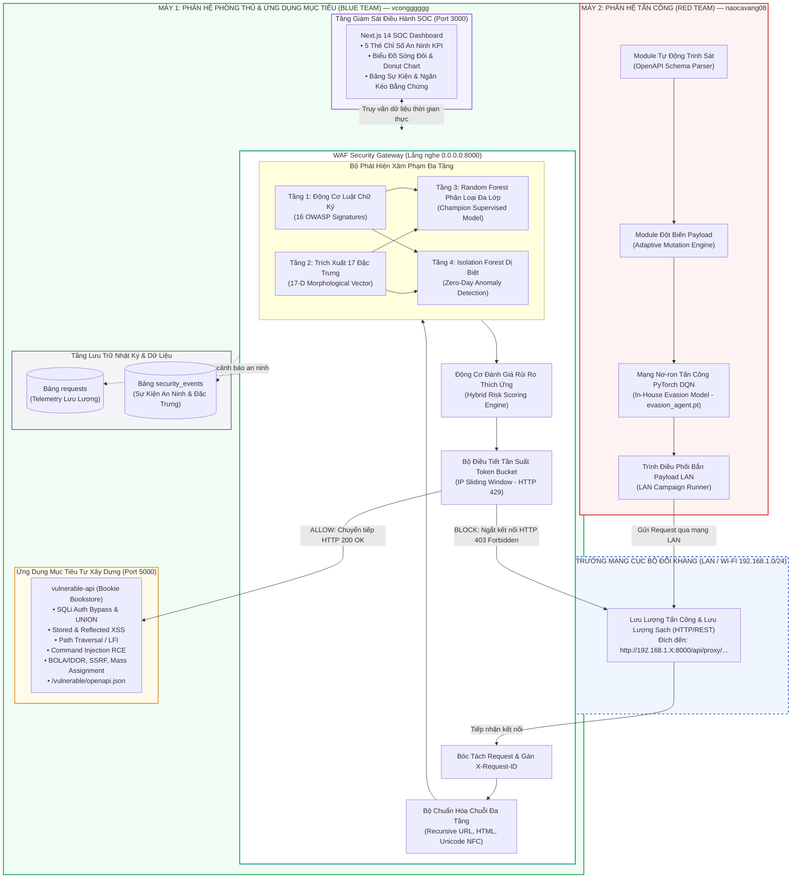
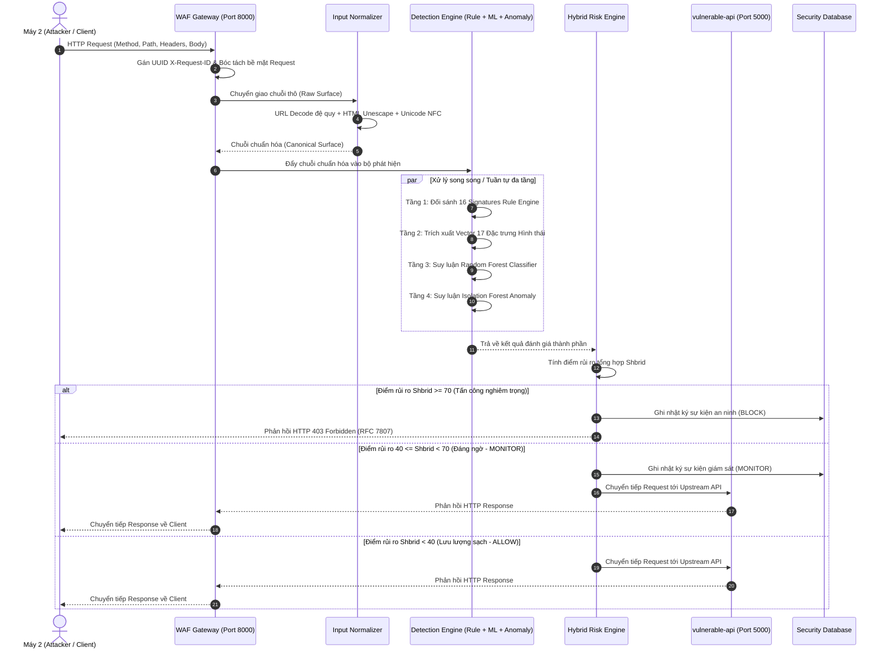

# CHƯƠNG 2: PHÂN TÍCH YÊU CẦU VÀ THIẾT KẾ KIẾN TRÚC HỆ THỐNG

---

## 2.1. Phân Tích Yêu Cầu Hệ Thống (System Requirements Analysis)

### 2.1.1. Bối cảnh bài toán và phạm vi đề tài
Trong kỷ nguyên số hóa hiện đại, các dịch vụ web và ứng dụng di động phụ thuộc phần lớn vào kiến trúc hướng dịch vụ (Service-Oriented Architecture - SOA) và giao diện lập trình ứng dụng RESTful (REST API) [Ref 20]. Khác với các ứng dụng Web truyền thống dựa trên việc kết xuất mã HTML từ phía máy chủ (Server-Side Rendering), các hệ thống API hiện đại trao đổi dữ liệu có cấu trúc (chủ yếu là định dạng JSON/XML) trực tiếp với máy khách hoặc giữa các vi dịch vụ (Microservices). Sự chuyển dịch kiến trúc này mở ra nhiều bề mặt tấn công mới mà các hệ thống tường lửa ứng dụng web truyền thống (WAF thế hệ cũ dựa hoàn toàn trên chữ ký chuỗi) không thể xử lý hiệu quả [Ref 07, Ref 16].

Nhằm giải quyết triệt để bài toán bảo vệ Web API trong môi trường thực tiễn, đề tài tập trung xây dựng một **Nền tảng Giám sát, Phát hiện và Ngăn chặn Tấn công Web API dựa trên Trí tuệ Nhân tạo và Học máy (AI/ML) kết hợp Môi trường Thao trường An ninh Mạng Đối kháng Phân tán (Distributed Cyber Range)** [Ref 01, Ref 02]. 

Phạm vi nghiên cứu và triển khai của đề tài bao gồm ba phân hệ trung tâm:
1. **Phân hệ Ứng dụng Mục tiêu (`vulnerable-api` - Bookie Bookstore):** Một hệ thống Web API thương mại điện tử thực tế tự xây dựng, mô phỏng đầy đủ các lỗ hổng an ninh nghiêm trọng nhất theo phân loại OWASP Web Application Top 10:2021 [Ref 15] và OWASP API Security Top 10:2023 [Ref 16].
2. **Phân hệ Cổng Phòng thủ Bảo mật Chủ động (`gateway` - WAF Reverse Proxy):** Một hệ thống Cổng ứng dụng (Application-Level Gateway [Ref 02]) chặn bắt mọi lưu lượng truy cập mạng ở Tầng 7 [Ref 20], tích hợp bộ chuẩn hóa đầu vào đệ quy, động cơ luật tất định 16 chữ ký, bộ trích xuất 17 đặc trưng hình thái [Ref 08], mô hình phân loại có giám sát Random Forest [Ref 13], mô hình phát hiện dị biệt Isolation Forest [Ref 14], động cơ đánh giá rủi ro thích ứng (Hybrid Decision Engine) và thuật toán giới hạn tần suất Token Bucket [Ref 06]. Hệ thống đi kèm một Trung tâm Chỉ huy An ninh SOC Dashboard trực quan hóa theo thời gian thực [Ref 18].
3. **Phân hệ Tác tử Tấn công Tự động (`attack-lab` - Offensive AI Red Team Agent):** Một tác tử tấn công độc lập vận hành trên máy tính vật lý riêng biệt trong mạng cục bộ LAN, có khả năng tự động phân tích lược đồ OpenAPI Schema [Ref 11], biến dị payload né tránh thích ứng và sử dụng mạng nơ-ron học tăng cường sâu (Deep Q-Network - DQN) tự phát triển bằng PyTorch để tìm kiếm điểm mù của hệ thống phòng thủ [Ref 10, Ref 12].

---

### 2.1.2. Phân tích yêu cầu chức năng (Functional Requirements - FR)

Hệ thống được thiết kế nhằm đáp ứng 7 nhóm yêu cầu chức năng cốt lõi (Bảng 2.1):

*Bảng 2.1: Bảng tổng hợp các yêu cầu chức năng của hệ thống (Functional Requirements)*

| Mã Yêu Cầu | Tên Yêu Cầu Chức Năng | Mô Tả Chi Tiết Kỹ Thuật | Phân Hệ Phụ Trách |
| :--- | :--- | :--- | :--- |
| **FR-01** | **Chặn bắt và Phân giải Bề mặt Request** | Chặn bắt toàn bộ lưu lượng HTTP/1.1 hướng tới ứng dụng mục tiêu; bóc tách đa tầng: HTTP Method, Request Path, Query Parameters, Headers và Request Body (JSON/Form). Cấp phát định danh duy nhất `X-Request-ID` (UUIDv4) phục vụ truy vết phân tán. | `gateway` (Reverse Proxy) |
| **FR-02** | **Chuẩn hóa Dữ liệu Đầu vào (Normalization)** | Giải mã đệ quy đa tầng URL Encoding (`%2527` -> `'`), khử thực thể HTML (`&quot;`, `&#x27;`), chuẩn hóa Unicode Canonicalization (NFC/NFKC) nhằm triệt tiêu các kỹ thuật vượt rào làm rối mã hóa (Obfuscation Evasion). | `gateway` (Input Normalizer) |
| **FR-03** | **Phát hiện Xâm phạm Đa tầng (Multi-Tier Detection)** | • **Tầng 1 (Rule-based):** So khớp 16 mẫu chữ ký tất định chuẩn OWASP (SQLi, XSS, Path Traversal, Command Injection). • **Tầng 2 (Supervised ML):** Phân loại đa lớp 5 nhóm hành vi dựa trên vector 17 đặc trưng thống kê. • **Tầng 3 (Unsupervised Anomaly):** Đo lường điểm dị biệt cô lập nhằm phát hiện biến thể Zero-day. | `gateway` (Detection Engine) |
| **FR-04** | **Ra Quyết định Đánh giá Rủi ro và Ngăn chặn Chủ động** | Tổng hợp điểm số rủi ro $S_{hybrid} \in [0, 100]$. Thực thi 4 hành động: `ALLOW` ($< 40$), `MONITOR` ($40 - 69$), `RATE_LIMIT` ($429$), `BLOCK` ($\ge 70$). Phản hồi lỗi ngắt kết nối theo định dạng chuẩn RFC 7807 Problem Details. | `gateway` (Risk Engine) |
| **FR-05** | **Điều tiết Tần suất Truy cập (Adaptive Rate Limiting)** | Kiểm soát tốc độ truy vấn theo từng địa chỉ IP nguồn bằng thuật toán Token Bucket kết hợp Sliding Window Counter. Ngăn chặn tấn công Brute Force và từ chối dịch vụ tầng ứng dụng (Application DDoS). | `gateway` (Rate Limiter) |
| **FR-06** | **Mô phỏng Lỗ hổng Nghiệp vụ Web API Đích** | Cung cấp 8 kịch bản lỗ hổng nghiêm trọng chuẩn OWASP Web & API Top 10 trên dịch vụ Bookie Bookstore (SQLite backend): SQLi Auth Bypass, SQLi UNION, XSS Stored/Reflected, Path Traversal, OS Command Injection, BOLA/IDOR, SSRF, Mass Assignment. Xuất bản đặc tả `/vulnerable/openapi.json`. | `vulnerable-api` |
| **FR-07** | **Tự động Trinh sát và Tấn công Né tránh Thích ứng** | Phân tích lược đồ OpenAPI Schema, sinh không gian hành vi biến dị payload; sử dụng mô hình học tăng cường sâu PyTorch DQN nội bộ huấn luyện chính sách né tránh WAF qua môi trường đối kháng LAN. | `attack-lab` (Red Team) |
| **FR-08** | **Giám sát và Trực quan hóa SOC Thời Gian Thực** | Bảng điều khiển SOC Dashboard: 5 thẻ KPI an ninh, biểu đồ lưu lượng sóng đôi (Sạch vs Tấn công), biểu đồ phân bố danh mục tấn công, bảng sự kiện trực tiếp và giao diện điều tra bằng chứng (Evidence Drawer). | `dashboard` |

---

### 2.1.3. Phân tích yêu cầu phi chức năng (Non-Functional Requirements - NFR)

Nhằm đảm bảo hệ thống có thể vận hành ổn định trong môi trường sản xuất thực tế với hiệu năng cao và độ an toàn tuyệt đối, các yêu cầu phi chức năng được chuẩn hóa theo Bảng 2.2:

*Bảng 2.2: Bảng chỉ số yêu cầu phi chức năng (Non-Functional Requirements & SLA)*

| Mã NFR | Tiêu Chí Phi Chức Năng | Chỉ Số Mục Tiêu (Metric / SLA) | Cơ Sở Tiêu Chuẩn / Đo Lường |
| :--- | :--- | :--- | :--- |
| **NFR-01** | **Độ trễ trung bình của WAF (Gateway Latency)** | $\le 15	ext{ ms}$ trên mỗi request ở tải tiêu chuẩn; Thời gian suy luận mô hình ML $\le 1.0	ext{ ms}$ (CPU thuần). | Đo lường nội bộ bằng Middleware High-Resolution Timer [Ref 06, Ref 07]. |
| **NFR-02** | **Thông lượng xử lý đồng thời (Throughput)** | $\ge 100	ext{ Requests/Second (RPS)}$ mà không làm thất thoát gói tin hoặc nghẽn hàng đợi kết nối. | Kiểm thử tải bất đồng bộ sử dụng `asyncio` và `httpx` [Ref 06]. |
| **NFR-03** | **Độ chính xác và Hiệu năng An ninh** | • Tỷ lệ phát hiện (Detection Recall): $\ge 90\%$. • Tỷ lệ dương tính giả (FPR trên tập Benign): $\le 1.0\%$. • Chỉ số Youden's Index: $J = 	ext{Recall} - 	ext{FPR} \ge 0.90$. | Khung kiểm định đánh giá OWASP Benchmark Project & ISO/IEC 27004:2016 [Ref 18]. |
| **NFR-04** | **Khả năng Chống Né tránh (Anti-Evasion Robustness)** | Vô hiệu hóa tối thiểu 90% các kỹ thuật làm rối mã hóa phổ biến: Nested URL Encoding, Hexadecimal, Unicode Halfwidth/Fullwidth, Comment Obfuscation (`/**/`), Khoảng trắng biến dị (`${IFS}`). | Tiêu chuẩn thử nghiệm NIST SP 800-115 [Ref 17] & IEEE TIFS 2022 [Ref 12]. |
| **NFR-05** | **Tính Cách ly và Khả năng Chịu lỗi (Fault Tolerance)** | Mô hình 2 máy phân tán độc lập qua mạng LAN vật lý; sự cố tê liệt ở máy tấn công không làm gián đoạn máy chủ phòng thủ. Hệ thống WAF hỗ trợ chế độ Fail-Open / Fail-Secure có thể cấu hình linh hoạt. | Mô hình Cyber Range phân tán Elsevier Yamin et al. 2020 [Ref 01]. |
| **NFR-06** | **Tính Chuẩn hóa và Khả năng Tương thích** | Tuân thủ nghiêm ngặt RFC 7807 (Problem Details for HTTP APIs) [Ref 19], RFC 9110 (HTTP Semantics) [Ref 20] và OpenAPI Specification 3.0 [Ref 11]. | Tiêu chuẩn quốc tế IETF & OpenAPI Initiative. |

---

## 2.2. Thiết Kế Kiến Trúc Tổng Thể Thao Trường Mạng Đối Kháng Phân Tán (Distributed Cyber Range Architecture)

### 2.2.1. Nguyên lý phân tách 2 máy vật lý độc lập (Blue Team vs Red Team)
Dựa trên nền tảng lý thuyết về Thao trường Mạng (Cyber Range) của Elsevier Yamin et al. 2020 [Ref 01], mô hình Trò chơi An ninh Đối kháng (Adversarial Security Game) của Jonathan Katz & Yehuda Lindell 2020 [Ref 04], và nguyên lý Cổng Ứng dụng (Application Gateway) của William Stallings 2017 [Ref 02], hệ thống được phân rã thành **hai thực thể vật lý độc lập kết nối qua mạng cục bộ LAN** (Hình 2.1):

*Hình 2.1: Sơ đồ kiến trúc tổng thể Thao trường An ninh Đối kháng Phân tán (Distributed Cyber Range: Máy 1 Blue Team vs Máy 2 Red Team)*

### 2.2.2. Ma trận phân chia trách nhiệm và môi trường thực thi

*Bảng 2.3: Bảng phân công trách nhiệm triển khai giữa hai máy vật lý*

| Tiêu Chí Triển Khai | Máy 1: Blue Team (Hệ Thống Phòng Thủ) | Máy 2: Red Team (Tác Tử Tấn Công) |
| :--- | :--- | :--- |
| **Thành viên đảm nhiệm** | Sinh viên: `vcongggggg` | Sinh viên: `naocavang08` |
| **Vai trò thao trường** | Blue Team (Defender / Application Owner) | Red Team (Attacker / Adversary) |
| **Dịch vụ vận hành** | • WAF Gateway (FastAPI, Port 8000) • Target API (`vulnerable-api`, Port 5000) • SOC Dashboard (Next.js 14, Port 3000) • Cơ sở dữ liệu SQLite / PostgreSQL | • OpenAPI Reconnaissance Parser • Mutation Obfuscation Engine • In-house PyTorch DQN Agent (`evasion_agent.pt`) • LAN Automated Attack Runner |
| **Cơ chế mạng** | Lắng nghe trên giao diện mạng toàn cục `0.0.0.0:8000` tiếp nhận request từ mạng LAN. | Gửi request hướng tới địa chỉ IP Máy 1 qua giao thức HTTP/1.1 trên mạng nội bộ. |
| **Nguyên tắc an toàn** | WAF đóng vai trò chốt chặn duy nhất; cổng 5000 bị cô lập trong mạng máy chủ. | Hoạt động tấn công bị giới hạn nghiêm ngặt trong tiền tố URL `/api/proxy/vulnerable/...`. |

---

## 2.3. Thiết Kế Chi Tiết Cổng WAF Gateway (Phân Hệ Phòng Thủ Chủ Động)

### 2.3.1. Mô hình Reverse Proxy và Pipeline Xử lý Request Tuần tự
Hệ thống WAF Gateway được thiết kế hoạt động dưới dạng **Cổng Ứng dụng Reverse Proxy (Application-Level Gateway Reverse Proxy)** theo kiến trúc chuẩn của Derek DeJonghe 2020 [Ref 06] và William Stallings 2017 [Ref 02]. 

Mọi truy vấn HTTP từ mạng bên ngoài khi gửi đến hệ thống đều bị chặn bắt tại Cổng WAF và trải qua quy trình xử lý tuần tự nghiêm ngặt 7 bước (Hình 2.2):

*Hình 2.2: Sơ đồ dòng dữ liệu xử lý tuần tự qua 7 giai đoạn trong WAF Gateway*

---

### 2.3.2. Thiết kế Module Chuẩn hóa Dữ liệu Đầu vào (Input Normalizer Engine)
Một trong những nguyên nhân hàng đầu khiến các hệ thống WAF truyền thống bị vượt qua là **kỹ thuật làm rối mã hóa (Encoding-based Evasion)** [Ref 12]. Để giải quyết triệt để vấn đề này, phân hệ Input Normalizer áp dụng giải thuật chuẩn hóa đệ quy 3 lớp:

1. **Giải mã URL Đệ quy (Recursive URL Decoding):**
   Nếu kẻ tấn công áp dụng kỹ thuật lồng mã hóa (Nested Percent-Encoding, ví dụ `%2527` giải mã lần 1 ra `%27`, giải mã lần 2 ra `'`), thuật toán sẽ lặp việc giải mã cho đến khi chuỗi đạt trạng thái dừng hội tụ (Fixed-point):
   $$	ext{URLDecode}^{(k)}(x) = 	ext{URLDecode}^{(k-1)}(x) \quad 	ext{với } k \le K_{max} = 5$$
   
2. **Khử Thực thể HTML (HTML Entity Unescaping):**
   Chuyển đổi toàn bộ các thực thể dạng tên (`&lt;`, `&gt;`, `&quot;`) hoặc dạng số thập phân/thập lục phân (`&#x3C;`, `&#60;`) về ký tự ASCII nguyên bản tương ứng.

3. **Chuẩn hóa Unicode Tương đương (Unicode Canonical Decomposition & Composition - NFC/NFKC):**
   Triệt tiêu các biến thể ký tự Unicode tương đương thị giác (Visual Spoofing) hoặc ký tự độ rộng toàn phần (Fullwidth Characters, ví dụ ký tự `＇` Unicode `＇` được chuyển đổi thành dấu nháy đơn `'` chuẩn ASCII `'`).

---

### 2.3.3. Thiết kế Động cơ Luật Tất định (Deterministic Signature Rule Engine)
Động cơ luật đóng vai trò chốt chặn Tầng 1 với tốc độ tính toán tức thời ($O(1)$ đến $O(M)$ đối sánh chuỗi). Hệ thống thiết kế **16 bộ luật an ninh quy chuẩn** chia đều cho 4 họ tấn công phổ biến nhất (Bảng 2.4):

*Bảng 2.4: Bảng đặc tả 16 bộ luật chữ ký tất định của Rule Engine*

| Mã Luật (Rule ID) | Họ Tấn Công (Attack Family) | Mẫu Biểu Thức Chính Quy (Regex Pattern) / Chữ Ký | Trọng Số Rủi Ro ($S_{rule}$) |
| :--- | :--- | :--- | :---: |
| `SQLI_AUTH_BYPASS` | SQL Injection | `('\|")\s*(or\|and)\s*('\|")?(\d+)\s*=\s*('\|")?` | 95 |
| `SQLI_UNION_SELECT` | SQL Injection | `union\s+(all\s+)?select\s+` | 95 |
| `SQLI_BOOLEAN_BLIND` | SQL Injection | `(sleep\|benchmark\|pg_sleep)\s*\(` | 90 |
| `SQLI_STACKED_QUERIES` | SQL Injection | `;\s*(drop\|insert\|update\|delete\|truncate)\s+` | 95 |
| `XSS_SCRIPT_TAG` | Cross-Site Scripting | `<\s*script[^>]*>.*?<\s*/\s*script\s*>` | 95 |
| `XSS_EVENT_HANDLER` | Cross-Site Scripting | `(onload\|onerror\|onclick\|onmouseover)\s*=` | 85 |
| `XSS_JAVASCRIPT_URI` | Cross-Site Scripting | `javascript\s*:\s*[^\s]+` | 90 |
| `XSS_IMG_SRC_INLINE` | Cross-Site Scripting | `<\s*img[^>]+src\s*=\s*['"]?javascript:` | 90 |
| `PATH_DOT_DOT_SLASH` | Path Traversal | `(\.\.[/\])+` | 90 |
| `PATH_SENSITIVE_FILES` | Path Traversal | `(etc/passwd\|etc/shadow\|windows/win\.ini\|boot\.ini)` | 95 |
| `PATH_NULL_BYTE` | Path Traversal | `%00\|\x00` | 85 |
| `PATH_ABSOLUTE_SYS` | Path Traversal | `^[a-zA-Z]:[/\]\|^\s*/(bin\|boot\|dev\|etc\|proc)` | 80 |
| `CMD_CHAINING_SEMI` | Command Injection | `;\s*(ls\|dir\|cat\|whoami\|id\|uname\|sh\|bash\|cmd\|powershell)` | 95 |
| `CMD_PIPE_EXEC` | Command Injection | `\|\s*(ls\|dir\|cat\|whoami\|id\|uname\|sh\|bash)` | 95 |
| `CMD_BACKTICK_EVAL` | Command Injection | `` `.*?` `` | 90 |
| `CMD_SUB_SHELL` | Command Injection | `\$\(.*?\)` | 90 |

---

### 2.3.4. Thiết kế Bộ Trích xuất Vector 17 Đặc trưng Hình thái (17-D Feature Extractor)
Dựa trên công trình nghiên cứu kinh điển của Torrano-Gimenez et al. (Wiley SCN 2015) [Ref 08] và mô hình học sâu IEEE Access 2024 [Ref 09], hệ thống thiết kế bộ trích xuất biến đổi một HTTP request bất kỳ thành một **vector số học 17 chiều chuẩn hóa $ec{x} \in \mathbb{R}^{17}$**. Các đặc trưng này hoàn toàn độc lập với ngôn ngữ tự nhiên và cấu trúc nghiệp vụ của từng API riêng biệt (Bảng 2.5):

*Bảng 2.5: Bảng đặc tả 17 đặc trưng hình thái trích xuất từ HTTP Request*

| STT | Tên Đặc Trưng ($f_i$) | Ý Nghĩa Kỹ Thuật & Công Thức Toán Học | Khoảng Giá Trị |
| :---: | :--- | :--- | :---: |
| 1 | `req_len` | Tổng độ dài ký tự của toàn bộ chuỗi bề mặt request $|S|$. | $[0, +\infty)$ |
| 2 | `path_len` | Độ dài ký tự của đường dẫn URL (Path). | $[0, +\infty)$ |
| 3 | `body_len` | Độ dài ký tự của phần thân dữ liệu (Request Body). | $[0, +\infty)$ |
| 4 | `param_count` | Số lượng tham số truyền vào qua Query String và Form Data. | $[0, +\infty)$ |
| 5 | `entropy` | Độ hỗn loạn thông tin Shannon Entropy: $H(S) = -\sum_{i=1}^{n} p_i \log_2 p_i$. | $[0, 8.0]$ |
| 6 | `digit_density` | Tỷ lệ ký tự chữ số trong chuỗi: $N_{digit} / |S|$. | $[0.0, 1.0]$ |
| 7 | `special_density` | Tỷ lệ ký tự đặc biệt ngoài bảng chữ cái và chữ số: $N_{special} / |S|$. | $[0.0, 1.0]$ |
| 8 | `upper_density` | Tỷ lệ ký tự viết hoa: $N_{upper} / |S|$ (Phát hiện kỹ thuật Case Alternation). | $[0.0, 1.0]$ |
| 9 | `sql_kw_count` | Tần suất xuất hiện các từ khóa SQL độc lập (`select`, `union`, `where`,...). | $[0, +\infty)$ |
| 10 | `xss_tag_count` | Tần suất xuất hiện các thẻ HTML độc hại (``. | Đánh cắp phiên làm việc và mã chứng thực của người dùng. |
| 4 | `GET /api/v1/vulnerable/files/download/?file=` | **OWASP Web A01:2021** (Broken Access) | Đường dẫn tệp tin không được chuẩn hóa hoặc chặn ký tự điều hướng: Kẻ tấn công truyền `../../../../etc/passwd` hoặc `../../../../windows/win.ini` để đọc các tệp cấu hình nhạy cảm của hệ điều hành máy chủ. | Lộ lọt mã nguồn, khóa mã hóa và thông tin hệ thống máy chủ. |
| 5 | `POST /api/v1/vulnerable/admin/ping/` | **OWASP Web A03:2021** (Command Injection) | Chức năng kiểm tra kết nối mạng sử dụng trực tiếp hàm shell hệ thống: `os.system("ping -c 1 " + target)`. Kẻ tấn công chèn toán tử nối lệnh: `127.0.0.1; whoami` hoặc `127.0.0.1 && cat /etc/passwd`. | Thực thi mã từ xa (Remote Code Execution - RCE), chiếm quyền điều khiển server. |
| 6 | `GET /api/v1/vulnerable/orders/{order_id}/` | **OWASP API1:2023** (BOLA / IDOR) | Hàm kiểm tra đơn hàng chỉ truy vấn theo `order_id` mà không kiểm tra quyền sở hữu của `user_id` trong JWT Token. Người dùng bình thường có thể truy cập đơn hàng của bất kỳ khách hàng nào khác bằng cách thay đổi ID tuần tự. | Vi phạm tính bảo mật và quyền riêng tư dữ liệu khách hàng. |
| 7 | `POST /api/v1/vulnerable/books/fetch-cover/` | **OWASP API7:2023** (Server-Side Request Forgery) | Chức năng tải ảnh bìa sách từ URL bên ngoài cho phép truyền địa chỉ IP nội bộ: Kẻ tấn công nhập `http://169.254.169.254/latest/meta-data/` hoặc `http://192.168.1.1/admin` để trinh sát mạng nội bộ. | Quét cổng dịch vụ nội bộ và trích xuất thông tin định danh đám mây. |
| 8 | `PUT /api/v1/vulnerable/users/profile/update/` | **OWASP API6:2023** (Mass Assignment) | Endpoint cập nhật hồ sơ người dùng nhận toàn bộ payload JSON và gán trực tiếp vào Model mà không có whitelist trường dữ liệu: Kẻ tấn công gửi kèm `{"is_admin": true, "role": "superuser"}`. | Leo thang đặc quyền người dùng trái phép (Privilege Escalation). |

---

### 2.4.3. Thiết kế Giao diện Trinh sát Tự động OpenAPI 3.0 Schema
Ứng dụng mục tiêu cung cấp điểm cuối tự động xuất bản tài liệu kỹ thuật tại `GET /api/v1/vulnerable/openapi.json`. Điểm cuối này tuân thủ đầy đủ đặc tả OpenAPI 3.0 [Ref 11], đóng vai trò là "mục tiêu mở" cho module trinh sát tự động của Tác tử Tấn công Red Team trên Máy 2.

---

## 2.5. Thiết Kế Phân Hệ Tác Tử Tấn Công Tự Động (Autonomous Offensive AI Red Team Agent)

### 2.5.1. Thiết kế Module Tự động Trinh sát (OpenAPI Reconnaissance Engine)
Dựa trên nguyên lý kiểm thử bảo mật REST API tự động của USENIX Security 2021 (RESTler) [Ref 11] và ACM Computing Surveys 2023 [Ref 10], module Reconnaissance trên Máy 2 hoạt động theo quy trình:
1. Gửi request trinh sát ban đầu: `GET http://192.168.1.X:8000/api/proxy/vulnerable/openapi.json`.
2. Phân tích cú pháp cây JSON, trích xuất toàn bộ:
   - Danh sách các đường dẫn (Paths).
   - Phương thức HTTP tương ứng (GET, POST, PUT, DELETE).
   - Bảng tham số yêu cầu (Parameters: Query, Path, Header, Request Body Schema).
3. Lập bản đồ bề mặt tấn công (Attack Surface Graph) và gán nhãn loại lỗ hổng tiềm năng tương ứng cho từng endpoint.

---

### 2.5.2. Thiết kế Không gian Trạng thái và Không gian Hành vi Đột biến (State & Action Space)
Để mô phỏng quá trình né tránh WAF, tác tử tấn công được mô hình hóa dưới dạng một Markov Decision Process (MDP) [Ref 10]:
- **Không gian Trạng thái ($S$):** Biểu diễn dưới dạng vector 17 đặc trưng $ec{s}_t \in \mathbb{R}^{17}$ tương ứng với hình thái của payload tại bước lặp $t$.
- **Không gian Hành vi Biến dị ($A$):** Tập hợp các toán tử đột biến chuỗi (Mutation Operators):
  - $a_1$: Mã hóa URL ngẫu nhiên một phần ký tự (`' -> %27`).
  - $a_2$: Chèn comment SQL ngẫu nhiên (`SELECT -> SE/**/LECT`).
  - $a_3$: Thay đổi xen kẽ chữ hoa/chữ thường (`union -> uNiOn`).
  - $a_4$: Thay thế khoảng trắng bằng ký tự phân tách tương đương (` ` -> `/**/` hoặc `${IFS}`).
  - $a_5$: Mã hóa ký tự HTML Entity (`< -> &lt;` hoặc `&#x3C;`).
  - $a_6$: Sử dụng toán tử ghép chuỗi (`'adm' || 'in'`).

---

### 2.5.3. Thiết kế Mạng Nơ-ron Học Tăng cường Sâu PyTorch DQN Nội bộ (`evasion_agent.pt`)
Để đảm bảo tính độc lập và làm chủ 100% công nghệ (không phụ thuộc vào các dịch vụ API bên thứ ba như OpenAI hay Ollama), nhóm nghiên cứu đã thiết kế một mạng Deep Q-Network (DQN) tự xây dựng bằng **PyTorch thuần túy** [Ref 10, Ref 12]:
- **Kiến trúc mạng:** Mạng truyền thẳng nhiều tầng (Multi-Layer Perceptron):
  - Tầng vào (Input Layer): 17 nơ-ron (nhận vector đặc trưng $ec{s}_t$).
  - Tầng ẩn 1 (Hidden 1): 128 nơ-ron, hàm kích hoạt ReLU, Dropout 0.1.
  - Tầng ẩn 2 (Hidden 2): 64 nơ-ron, hàm kích hoạt ReLU.
  - Tầng ra (Output Layer): $|A| = 6$ nơ-ron biểu diễn giá trị $Q(s, a)$ cho từng hành vi đột biến.
- **Hàm Thưởng / Phạt Đối kháng (Reward Function):**
  $$R(s_t, a_t, s_{t+1}) = egin{cases} 
  +10 & 	ext{nếu WAF cho qua (HTTP 200 OK) và kích hoạt thành công lỗ hổng} \
  +3  & 	ext{nếu WAF chỉ gắn cờ MONITOR (HTTP 200 OK nhưng bị phát hiện)} \
  -1  & 	ext{nếu WAF chặn thành công (HTTP 403 Forbidden)} \
  -5  & 	ext{nếu payload bị hỏng cú pháp không thực thi được}
  \end{cases}$$

---

## 2.6. Thiết Kế Cơ Sở Dữ Liệu và Lưu Trữ Nhật Ký An Ninh (Security Data Storage)

Hệ thống WAF Gateway sử dụng cơ sở dữ liệu quan hệ tối ưu hóa cao nhằm ghi nhận toàn bộ vòng đời của từng request và các sự kiện an ninh tương ứng phục vụ phân tích điều tra số (Forensics) và hiển thị trực quan trên SOC Dashboard [Ref 18].

### 2.6.1. Thiết kế Lược đồ Bảng `requests` (Lưu vết Lưu lượng)
*Bảng 2.8: Cấu trúc lược đồ dữ liệu bảng `requests`*

| Tên Cột | Kiểu Dữ Liệu | Ràng Buộc | Ý Nghĩa Kỹ Thuật |
| :--- | :--- | :--- | :--- |
| `id` | `INTEGER` | `PRIMARY KEY AUTOINCREMENT` | Khóa chính định danh bản ghi lưu lượng. |
| `request_id` | `VARCHAR(36)` | `UNIQUE, NOT NULL` | Mã định danh UUIDv4 gắn kèm tiêu đề `X-Request-ID`. |
| `timestamp` | `TIMESTAMP` | `DEFAULT CURRENT_TIMESTAMP` | Thời điểm chính xác tiếp nhận request tại Gateway. |
| `client_ip` | `VARCHAR(45)` | `NOT NULL` | Địa chỉ IPv4 hoặc IPv6 của máy khách gửi yêu cầu. |
| `method` | `VARCHAR(10)` | `NOT NULL` | Phương thức HTTP (GET, POST, PUT, DELETE,...). |
| `url_path` | `TEXT` | `NOT NULL` | Đường dẫn URI yêu cầu sau khi bóc tách. |
| `query_params` | `TEXT` | `NULLABLE` | Chuỗi truy vấn thô và tham số URL. |
| `headers_json` | `TEXT` | `NOT NULL` | Toàn bộ tiêu đề HTTP dưới định dạng chuỗi JSON. |
| `body_raw` | `TEXT` | `NULLABLE` | Nội dung phần thân của request (Body Payload). |
| `status_code` | `INTEGER` | `NOT NULL` | Mã trạng thái HTTP phản hồi về máy khách (200, 403, 429,...). |
| `latency_ms` | `FLOAT` | `NOT NULL` | Tổng thời gian xử lý toàn trình của WAF (mili-giây). |

---

### 2.6.2. Thiết kế Lược đồ Bảng `security_events` (Sự kiện Cảnh báo An ninh)
*Bảng 2.9: Cấu trúc lược đồ dữ liệu bảng `security_events`*

| Tên Cột | Kiểu Dữ Liệu | Ràng Buộc | Ý Nghĩa Kỹ Thuật |
| :--- | :--- | :--- | :--- |
| `event_id` | `INTEGER` | `PRIMARY KEY AUTOINCREMENT` | Khóa chính định danh sự kiện bảo mật. |
| `request_id` | `VARCHAR(36)` | `FOREIGN KEY (requests.request_id)` | Khóa ngoại liên kết trực tiếp với bảng `requests`. |
| `timestamp` | `TIMESTAMP` | `DEFAULT CURRENT_TIMESTAMP` | Thời điểm phát hiện sự kiện an ninh. |
| `rule_score` | `FLOAT` | `NOT NULL` | Điểm rủi ro từ Động cơ Luật tất định ($S_{rule}$). |
| `triggered_rules`| `TEXT` | `NULLABLE` | Danh sách mã luật bị kích hoạt (phân tách bằng dấu phẩy). |
| `rf_pred_class` | `VARCHAR(30)` | `NOT NULL` | Nhãn phân loại dự đoán từ mô hình Random Forest. |
| `rf_confidence` | `FLOAT` | `NOT NULL` | Xác suất tin cậy của nhãn dự đoán ($P_{RF} \in [0.0, 1.0]$). |
| `if_anomaly_score`| `FLOAT` | `NOT NULL` | Điểm số bất thường dị biệt từ mô hình Isolation Forest. |
| `hybrid_score` | `FLOAT` | `NOT NULL` | Điểm rủi ro tổng hợp cuối cùng ($S_{hybrid} \in [0, 100]$). |
| `action_taken` | `VARCHAR(15)` | `NOT NULL` | Quyết định hành động: `ALLOW`, `MONITOR`, `RATE_LIMIT`, `BLOCK`. |
| `features_json` | `TEXT` | `NOT NULL` | Trị số cụ thể của vector 17 đặc trưng hình thái phục vụ giải thích. |

---

## 2.7. Tóm Tắt Chương 2

Chương 2 đã hoàn thành toàn diện việc phân tích yêu cầu bài toán và thiết kế kiến trúc hệ thống cho đề tài nghiên cứu:
1. **Phân tích yêu cầu bài toán:** Xác lập rõ 8 yêu cầu chức năng (FR-01 đến FR-08) và 6 chỉ số phi chức năng nghiêm ngặt (NFR-01 đến NFR-06), khẳng định mục tiêu thiết kế một hệ thống phòng thủ API thông minh, độ trễ thấp ($\le 15	ext{ ms}$), thông lượng cao ($\ge 100	ext{ RPS}$) và độ nhạy phát hiện an ninh đạt chuẩn quốc tế ($J \ge 0.90$).
2. **Kiến trúc Thao trường An ninh Đối kháng Phân tán:** Thiết kế và phân định ranh giới rõ ràng giữa hai máy tính vật lý độc lập kết nối qua mạng LAN (Máy 1: Blue Team vận hành WAF Gateway, Ứng dụng mục tiêu Bookie Bookstore và SOC Dashboard; Máy 2: Red Team vận hành Tác tử Tấn công Tự động sử dụng mô hình học tăng cường sâu PyTorch DQN).
3. **Thiết kế Cổng WAF Gateway:** Chi tiết hóa quy trình xử lý tuần tự 7 bước, kết hợp module chuẩn hóa dữ liệu đệ quy, động cơ luật 16 chữ ký, bộ trích xuất vector 17 đặc trưng hình thái, kiến trúc học máy kép (Random Forest + Isolation Forest), động cơ đánh giá rủi ro thích ứng Hybrid Decision Engine và bộ điều tiết tần suất Token Bucket.
4. **Thiết kế Ứng dụng Mục tiêu & Tác tử Tấn công:** Xây dựng chi tiết 8 kịch bản lỗ hổng nghiêm trọng chuẩn OWASP Top 10 Web & API trên nền tảng Bookie Bookstore và thiết lập không gian trạng thái/hành vi đột biến cho tác tử tấn công tự động né tránh WAF.
5. **Thiết kế Cơ sở Dữ liệu:** Xác lập đầy đủ lược đồ hai bảng dữ liệu `requests` và `security_events`, đảm bảo khả năng đối soát chứng cứ số và tích hợp mượt mà với SOC Dashboard.

Toàn bộ các thiết kế kiến trúc và mô hình dữ liệu trong Chương 2 sẽ là kim chỉ nam kỹ thuật chuẩn xác để tiến hành cài đặt và hiện thực hóa hệ thống trong Chương 3.
