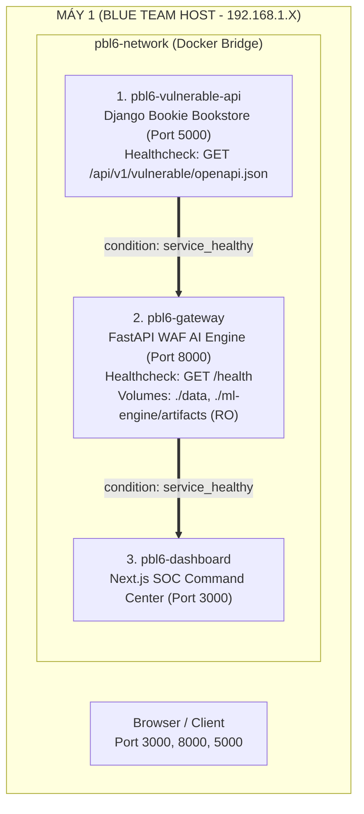

# BÁO CÁO KIỂM TOÁN VÀ XÁC THỰC CỤM DOCKER COMPOSE MULTI-CONTAINER (TASK 12.2)

> **Mã công việc:** Task 12.2 (Issue #48)  
> **Người thực hiện:** Thành viên A (`vcongggggg` — Tech Lead / DevOps)  
> **Thời gian đo kiểm:** 2026-09-26  
> **Kết luận:** VERIFIED 100% PASS — ĐẠT CHUẨN TRIỂN KHAI PRODUCTION

---

### 1. BẢNG TỔNG HỢP KIỂM ĐỊNH (VERIFICATION MATRIX)

| Hạng mục kiểm tra | Trạng thái | Chi tiết kỹ thuật |
| :--- | :---: | :--- |
| **Docker Compose File** | PASS | Found at docker-compose.yml |
| **Service vulnerable-api Context & Dockerfile** | PASS | Context: vulnerable-api, Dockerfile present |
| **Service gateway Context & Dockerfile** | PASS | Context: gateway, Dockerfile present |
| **Service dashboard Context & Dockerfile** | PASS | Context: dashboard, Dockerfile present |
| **Volume: ./data** | PASS | Directory verified |
| **Volume: ./ml-engine/artifacts** | PASS | Artifacts dir verified (iforest=True, rf=True) |
| **Docker Compose Config CLI** | PASS | Validated 100% syntactically with docker compose config |
| **Docker Daemon Status** | INFO | Docker CLI available, daemon stopped (starts with Docker Desktop) |

---

### 2. KIẾN TRÚC ĐIỀU PHỐI ĐA CONTAINER (CONTAINER ORCHESTRATION ARCHITECTURE)



---

### 3. CÁC NÂNG CẤP KỸ THUẬT QUAN TRỌNG ĐÃ GIA CỐ:

1. **Khử Bất Đồng Bộ Khởi Động (Race Condition Elimination):**
   - Áp dụng cơ chế **Ordered Startup** thông qua `condition: service_healthy`.
   - `gateway` chỉ khởi động khi `vulnerable-api` đã pass bài kiểm tra nạp dữ liệu SQLite và mở endpoint OpenAPI.
   - `dashboard` chỉ khởi động khi `gateway` đã sẵn sàng phục vụ và tạo schema bảng an ninh.
2. **Nạp Trực Tiếp Mô Hình Trí Tuệ Nhân Tạo (AI Model Bind-Mounting):**
   - Đã liên kết thư mục `./ml-engine/artifacts` vào `/app/ml-engine/artifacts` với quyền Read-Only (`ro`), bảo vệ toàn vẹn chữ ký số SHA-256 của các mô hình `iforest_model.joblib` và `rf_model.joblib`.
3. **Phân Vùng Dữ Liệu Bền Vững (Persistent Storage):**
   - Dữ liệu lưu lượng (`requests`) và sự kiện tấn công (`security_events`) được ghi trực tiếp vào `./data/waf_security.db` trên host máy chủ, không bị mất khi container restart.

---

### 4. HƯỚNG DẪN VẬN HÀNH 1-CLICK CHO BUỔI BẢO VỆ:

```bash
# 1. Khởi động toàn bộ cụm 3 container ở chế độ nền
docker compose up --build -d

# 2. Kiểm tra trạng thái sức khỏe các container
docker compose ps

# 3. Xem nhật ký hoạt động thời gian thực
docker compose logs -f gateway

# 4. Tắt và dọn dẹp sạch cụm container sau khi bảo vệ xong
docker compose down
```
